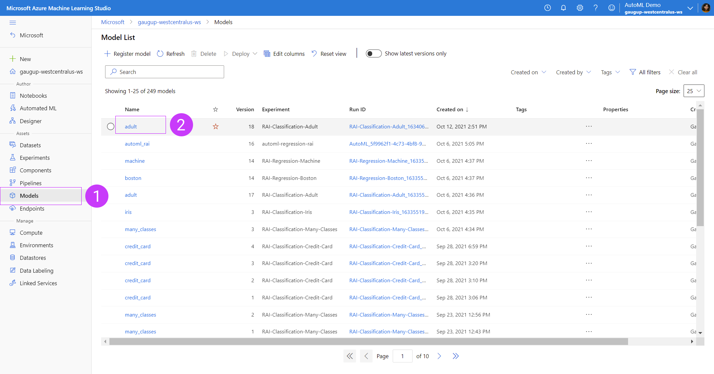
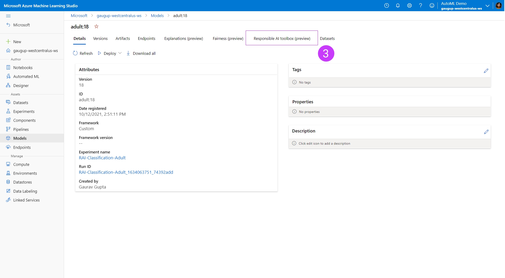
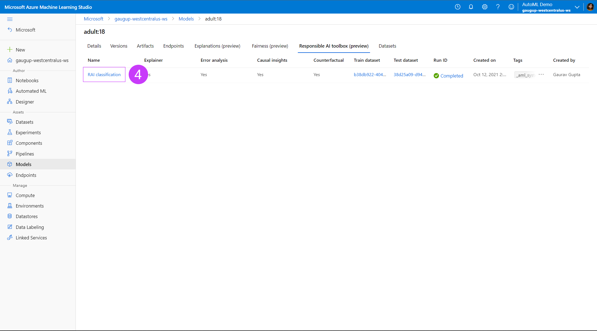
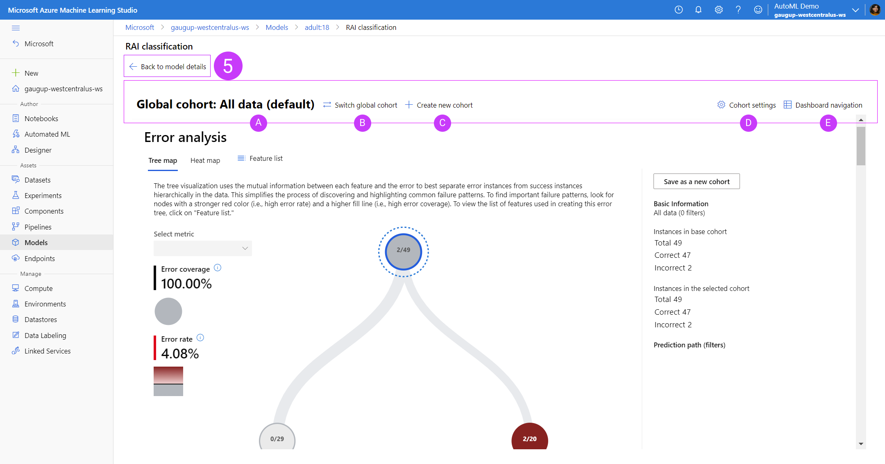
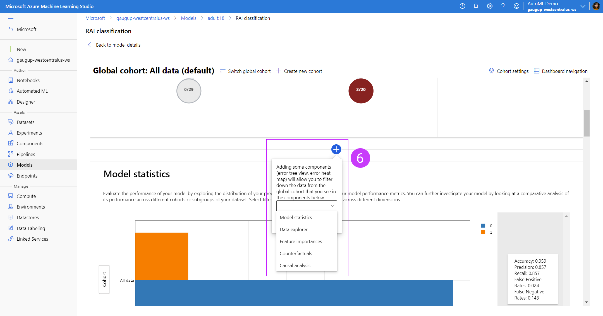

# Azure Machine Learning Responsible AI Dashboard

Welcome to the public preview for the new Responsible AI dashboard in Azure Machine Learning (AzureML) SDK/CLIv2 and studio. The following is a guide for you to onboard to the new capabilities. For questions, please contact mithigpe@microsoft.com. Visit the [Microsoft how-to docs](aka.ms/https://aka.ms/DocsHowtoRAI) relating to this repo.

## What is this new feature?

AzureML currently supports both [model explanations](https://docs.microsoft.com/en-us/azure/machine-learning/how-to-machine-learning-interpretability-aml) and [model fairness](https://docs.microsoft.com/en-us/azure/machine-learning/how-to-machine-learning-fairness-aml) in public preview. As we expand our offerings under Responsible AI tools for AzureML users, this new feature brings pre-existing features and brand new offerings under one-stop-shop SDK package and studio UI dashboard:
- Error Analysis (new): view and understand the error distributions of your model over your dataset via a decision tree map or heat map visualization.
- Data Explorer: explore your dataset by feature sets and other metrics such as predicted Y or true Y
- Model Statistics: explore the distribution of your model outcomes and performance metrics
- Interpretability: view the aggregate and individual feature importances across your model and dataset
- Counterfactual What-If's (new): create automatically generated diverse sets of counterfactual examples for each datapoint that is minimally perturbed in order to switch its predicted class or output. Also create your own counterfactual datapoint by perturbing feature values manually to observe the new outcome of your model prediction.
- Causal Analysis (new): view the aggregate and individual causal effects of *treatment features* (features which you are interested in controlling) on the outcome in order to make informed real-life business decisions. See recommended treatment policies for segmentations of your population for features in your dataset to see the effect on your real-life outcomes. 

This new feature offers users a new powerful and robust toolkit for understanding your model and data in order to develop your machine learning models responsibly, now all in one place and integrated with your AzureML workspace.

❗ **Please note:** This initial version of the Responsible AI dashboard currently does not support the integration of fairness metrics. For fairness metrics, please refer to our existing offering [here.](https://docs.microsoft.com/en-us/azure/machine-learning/how-to-machine-learning-fairness-aml)

## Supported scenarios, models and datasets

The AzureML components in this repo support computation of Responsible AI insights for `scikit-learn` models that are trained on `pandas.DataFrame`.
The components accept both models and SciKit-Learn pipelines as input as long as the model or pipeline implements `predict` and `predict_proba` functions that conforms to the `scikit-learn` convention.
If not compatible, you can wrap your model's prediction function into a wrapper class that transforms the output into the format that is supported (`predict` and `predict_proba` of `scikit-learn`), and pass that wrapper class to modules in this repo.

Currently, we support datasets having numerical and categorical features. The following table provides the scenarios supported for each of the four responsible AI insights:-

| RAI insight | Binary classification | Multi-class classification | Multilabel classification | Regression | Timeseries forecasting | Categorical features | Text features | Image Features | Recommender Systems | Reinforcement Learning |
| --- | --- | --- | --- | --- | --- | --- | --- | --- | --- | -- |
| Explainability | Yes | Yes | No | Yes | No | Yes | No | No | No | No |
| Error Analysis | Yes | Yes | No | Yes | No | Yes | No | No | No | No |
| Causal Analysis | Yes | No | No | Yes | No | Yes (max 5 features due to computational cost) | No | No | No | No |
| Counterfactual | Yes | Yes | No | Yes | No | Yes | No | No | No | No |

This is all available via Python SDK or CLI.

## Set Up
In this section, we will go over the basic setup steps that you need in order to generate Responsible AI insights for your models from SDK v2, CLI v2 and visualize the generated Responsible AI insights in [AML studio](https://ml.azure.com/).

### Install Miniconda

Our setup script assumes that `conda` is installed and configured for your shell. [Download and install MiniConda](https://docs.conda.io/en/latest/miniconda.html) (External link).
After installation, restart your shell, and make sure that you can run `conda` commands.

### Create an AzureML workspace
Create an AzureML workspace by using the [configuration notebook](https://github.com/Azure/MachineLearningNotebooks/blob/master/configuration.ipynb)

### Install the Azure CLI

Install the Azure CLI by [following the instructions on the Microsoft docs site](https://docs.microsoft.com/en-us/cli/azure/install-azure-cli).

### Clone this repository

If you have not already done so, clone this repository, and move into the root directory:
```bash
git clone https://github.com/Azure/RAI-vNext-Preview.git
cd RAI-vNext-Preview
```

### Log in to Azure

Run the following to make sure you are logged in to Azure:
```bash
az login
```

### Run the setup script

We provide a setup script which:

- Creates a new `conda` environment
- Installs all the required Python packages
- Registers all the RAI components in your AzureML workspace
- Sets the defaults for the `az` CLI to point to your workspace

To run the script in powershell, from the repository root, run:
```powershell
 .\Quick-Setup.ps1
 ```
 alternatively, an equivalent script for `bash`:
 ```bash
 ./quick-setup.bash <CONDA-ENV-NAME> <SUBSCRIPTION-ID> <RESOURCE-GROUP-NAME> <WORKSPACE-NAME>
 ```
 This script will echo the supplied arguments and then pause briefly before continuing.
 

### Generating Responsible AI Dashboard insights
Once you have created an Azure workspace and registered your components in the one-time setup above, you can create a Responsible AI dashboard via the CLI or SDK. Start here for `examples` [folder](examples) to get started.

#### Limitations

The current set of components have a number of limitations on their use:

- All models must be in registered in AzureML in MLFlow format with an sklearn flavour
- The models must be loadable in the component environment
- The models must be pickleable
- The models must be supplied to the RAI components using the 'Fetch Registered Model' component which we provide. We plan to switch to the new AzureML 'model-as-input' feature in the near future
- The dataset inputs must be `pandas` DataFrames in Parquet format. We plan to start using AzureML's new `MLTable` feature in the near future
- A model must still be supplied even if only a causal analysis of the data is performed. The `DummyClassifier` and `DummyRegressor` estimators from SciKit-Learn can be used for this purpose


### Viewing your Responsible AI Dashboard in the AzureML studio portal
After generating the Responsible AI insights, you can view them in your associated workspace in AzureML studio, under your model registry.


1. Go to your model registry in your AzureML studio workspace
2. Click on the model for which you've uploaded your Responsible AI insights


3. Click on the tab for `Responsible AI dashboard (preview)` under your model details page


4. Under the `Responsible AI dashboard (preview)` tab of your model details, you will see a list of your uploaded Responsible AI insights. You can upload more than one Responsible AI dashboard for each model. Each row represents one dashboard, with information on which components were uploaded to each dashboard (i.e. explanations, counterfactuals, etc).


5. At anytime while viewing the dashboard, if you wish to return to the model details page, click on `Back to model details`
<ol type="A">
  <li>You can view the dashboard insights for each component filtered down on a cohort you specify (or view all the data with the global cohort). Hovering over the cohort name will show the number of datapoints and filters in that cohort as a tooltip.</li>
  <li>Switch which cohort you are applying to the dashboard.</li>
  <li>Create a new cohort based on filters you can apply in a flyout panel.</li>
  <li>View a list of all cohorts created and duplicate, edit or delete them.</li>
  <li>View a list of all Responsible AI components you've uploaded to this dashboard as well as hiding components. The layout of the dashboard will reflect the order of the components in this list.</li>
</ol>

❗ **Please note:** Error Analysis, if generated, will always be at the top of the component list in your dashboard. Selecting on the nodes of the error tree or tiles of the error heatmap will automatically generate a temporary cohort that will be populated in the components below so that you can easily experiment with looking at insights for different areas of your error distribution.


6. In between each component you can add components by clicking the blue circular button with a plus sign. This will pop up a tooltip that will give you an option of adding whichever Responsible AI component you enabled with your SDK.

#### Accessing full functionality with a connected compute resource in Azure ML studio
Integrated compute instance must be attached to the Responsible AI dashboard to enable full functionality:
**Error analysis**
- Setting your global data cohort to any cohort of interest will update the error tree instead of disabling it.
- Selecting other error or performance metrics is supported.
- Selecting any subset of features for training the error tree map is supported.
- Changing the minimum number of samples required per leaf node and error tree depth is supported.
- Dynamically updating the heatmap for up to two features is supported.
**Feature importances**
- An individual conditional expectation (ICE) plot in the individual feature importance tab is supported.
Counterfactual analysis
- Generating a new what-if counterfactual datapoint to understand the minimum change required for a desired outcome is supported.
***Causal analysis***
- Selecting any individual datapoint, perturbing its treatment features, and seeing the expected causal outcome of causal what-if is supported (only for regression ML scenarios).

If the Responsible AI dashboard is created and viewed in a Jupyter notebook with a Python backend, it will be fully featured when running in that notebook.

## Responsible AI Dashboard walkthrough and sample notebooks
Please read through our [examples folder](examples) to see if this feature supports your use case. For more details about each individual component, please read through our brief [tour guide of the new Responsible AI dashboard capabilities.](https://github.com/microsoft/responsible-ai-widgets/blob/main/notebooks/responsibleaitoolbox-dashboard/tour.ipynb) 

## Contributing

This project welcomes contributions and suggestions.  Most contributions require you to agree to a
Contributor License Agreement (CLA) declaring that you have the right to, and actually do, grant us
the rights to use your contribution. For details, visit https://cla.opensource.microsoft.com.

When you submit a pull request, a CLA bot will automatically determine whether you need to provide
a CLA and decorate the PR appropriately (e.g., status check, comment). Simply follow the instructions
provided by the bot. You will only need to do this once across all repos using our CLA.

This project has adopted the [Microsoft Open Source Code of Conduct](https://opensource.microsoft.com/codeofconduct/).
For more information see the [Code of Conduct FAQ](https://opensource.microsoft.com/codeofconduct/faq/) or
contact [opencode@microsoft.com](mailto:opencode@microsoft.com) with any additional questions or comments.

## Trademarks

This project may contain trademarks or logos for projects, products, or services. Authorized use of Microsoft 
trademarks or logos is subject to and must follow 
[Microsoft's Trademark & Brand Guidelines](https://www.microsoft.com/en-us/legal/intellectualproperty/trademarks/usage/general).
Use of Microsoft trademarks or logos in modified versions of this project must not cause confusion or imply Microsoft sponsorship.
Any use of third-party trademarks or logos are subject to those third-party's policies.

